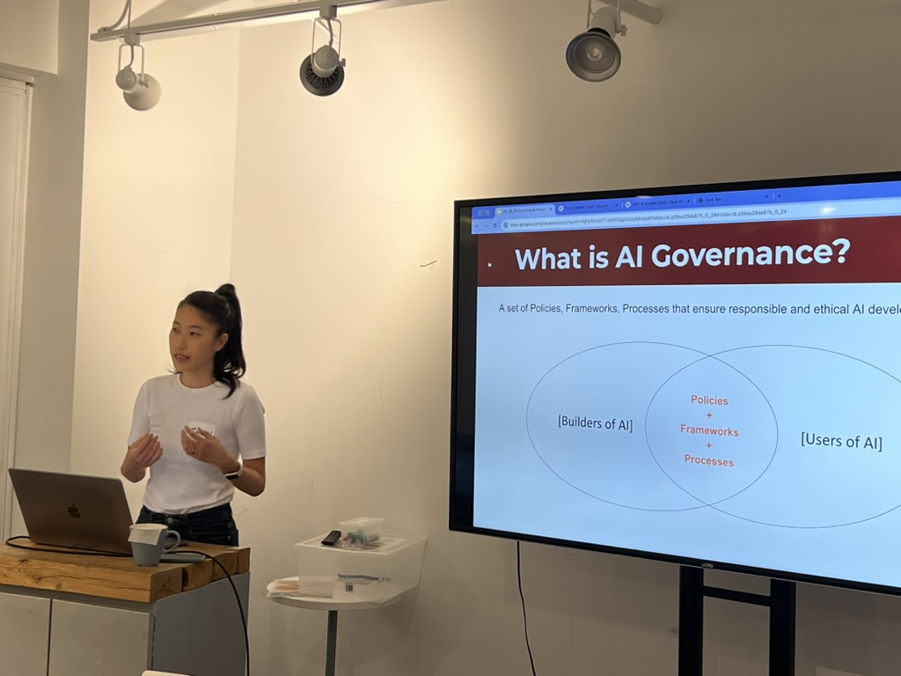
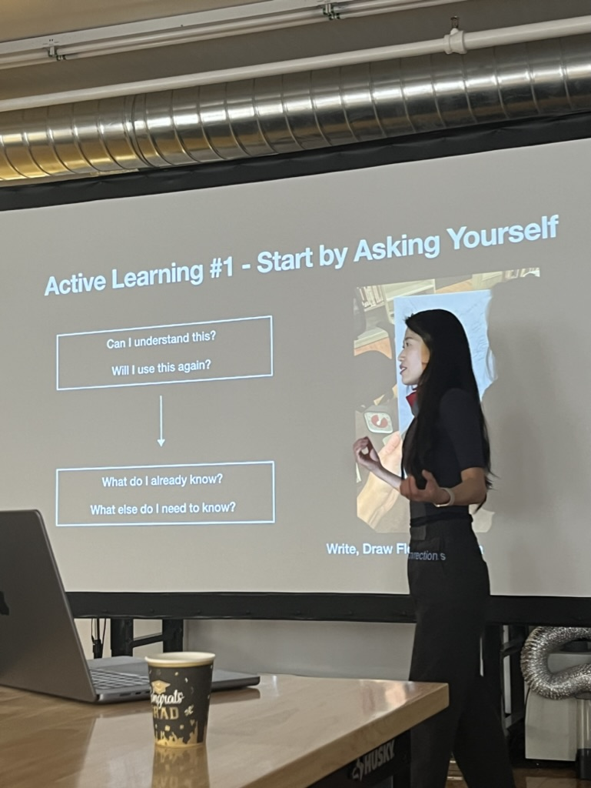
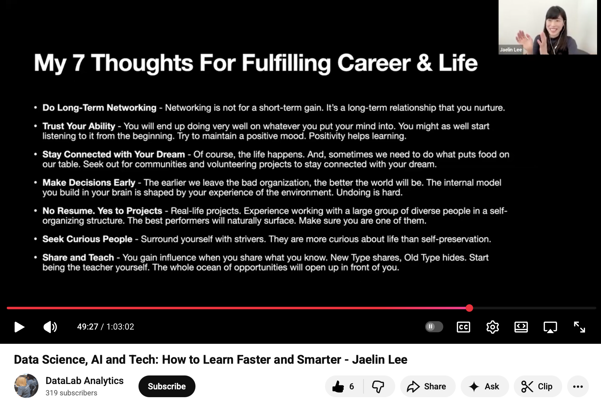
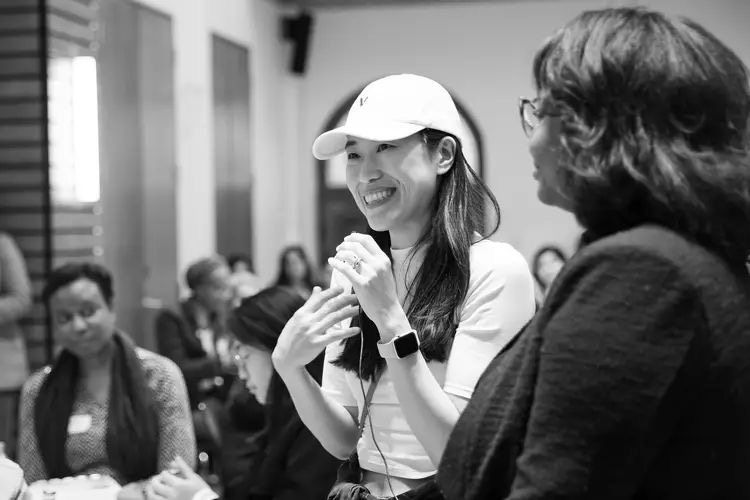

**Bridging strategy and execution**, I help teams align, scope priorities, and translate vision into shipped ML systems.

From architecture to delivery, I align machine learning systems with real-world constraints — technical, operational, and ethical — **to deploy models that are reliable, monitorable, and accountable**.

  

    <h3>🧱 Architecture</h3>
    
Cloud-first ML systems with agent orchestration, monitoring, and scalable deployment — across public/private sectors.

  

  

    <h3>🔐 Governance</h3>
    
Model cards, drift diagnostics, versioning, and risk logging — baked into every handover.

  

  

    <h3>🤝 Consulting</h3>
    
Cross-functional leadership on AI strategy, ML infra, and ethical deployment at scale.

  

 

---
## ML Architecture & Orchestration

Design and deploy production-ready ML pipelines that integrate model inference, API services, data preprocessing, and agent-based reasoning — all under real-world constraints like latency, cost, compliance, and scale.

**Recent work includes:**

- Architected cloud-optimized inference pipelines for diverse ML tasks including computer vision, time-series, structured, and unstructured data  
- Integrated LLMs, RAG pipelines, and LangGraph agents into a modular ML serving stack powering chatbot, search, and workflow automation tools  
- Developed governance tooling: model cards, retraining triggers, and audit-ready versioning
- Supported full-stack integration across frontend, backend, ML, data engineering, and MLOps workflows
- Thrived in fast-paced R&D cycles, translating ML ideas into end-to-end prototypes with real-world impact

---

## Leadership & Technical Strategy

Beyond implementation, I help shape product and team direction — from scoping and trade-offs to alignment and iteration.

- Translate broad vision into actionable, time-bound deliverables
- Facilitate alignment across ML, product, and data teams
- Drive progress via technical reviews, mentoring, and hands-on contributions
- Aim to bring clear communication and system-level thinking to help cross-functional teams stay aligned

---

## AI Governance & Risk Alignment

MLOps doesn’t end at deployment — I embed traceability, explainability, and version control into every solution. From regulatory constraints to domain drift, I ensure deployed models remain aligned with both business goals and real-world behavior.

**My MLOps Governance Toolkit:**
- Model & Data Card
- Drift diagnostics
- Retraining triggers + risk logging
- Audit-ready, versioned model registries (e.g. MLflow, W&B)
- Template to bring back drifted AI to alignment

---

## Let’s Connect

I’m energized by distilling complexity into clarity — through systems thinking, storytelling, and presentation. Whether I’m building AI infrastructure or shaping a narrative, I love turning scattered ideas into tools others can trust and use.

You can reach me via [LinkedIn](https://www.linkedin.com/in/jaelin-lee-23678458/) or [YouTube](https://www.youtube.com/@withjaelinlee).

  

<h2>🎤 Public Speaking</h2>

  

  

    
    <button onclick="nextImage('img-exploring-ai', ['img/exploring_ai.jpeg', 'img/exploring_ai_2.jpeg', 'img/exploring_ai_3.jpeg'])"
            style="position: absolute; top: 85%; right: 10px; transform: translateY(-50%);
                   background: rgba(255,255,255,0.8); border: none; border-radius: 50%; padding: 6px 10px;
                   cursor: pointer; font-size: 1.2em;">
      →
    </button>
  

  <h4 style="margin-top: 0.8em;">ExploringAI, Canada</h4>
    
Presented <AI Governance in Real Life: How to Choose AI Tools That Reflect Your Values>.

  

  

    
    <h4 style="margin-top: 0.8em;">Onaki FabLab, Canada</h4>
    
Motivational speech: Active learning skills workshop for indigenous tech talents.

  

  

  

    
    <button onclick="nextImage('datalab-analytics', ['img/datalab_analytics.png', 'img/datalab_analytics_2.png'])"
            style="position: absolute; top: 85%; right: 10px; transform: translateY(-50%);
                   background: rgba(255,255,255,0.8); border: none; border-radius: 50%; padding: 6px 10px;
                   cursor: pointer; font-size: 1.2em;">
      →
    </button>
  

  <h4 style="margin-top: 0.8em;">DataLab Analytics, Africa</h4>
    
Motivational speech: Learning skills & fulfilling career insights for aspiring data professionals.

  

 

    
  <h4 style="margin-top: 0.8em;">Inspired to Speak: A Turning Point</h4>
    
At a Public Speaking & Personal Branding workshop, I asked guest speaker Jesse Jones: "Sometimes when I find something insightful, I am not sure whether it will be insightful to others as well or not. So, I hesitate and end up not sharing... How do you handle these situations?" He replied: "Keep sharing. Even if your message impacted only one person. But, it changed their life. Does it matter? Ask your self - When will I be comfortable with the way I do things?". That moment reshaped how I approach storytelling. Since then, my sharing journey has continued.

  

---
